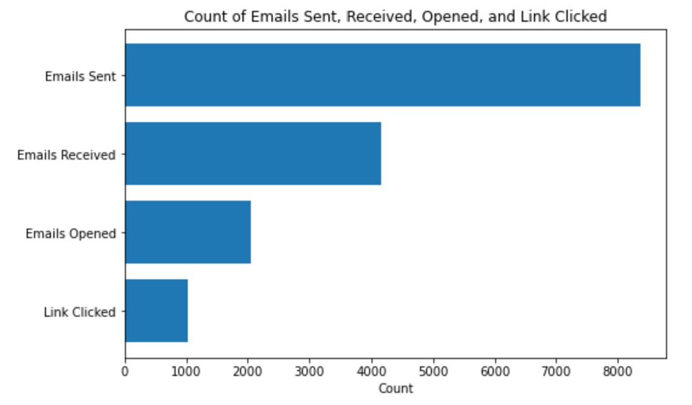
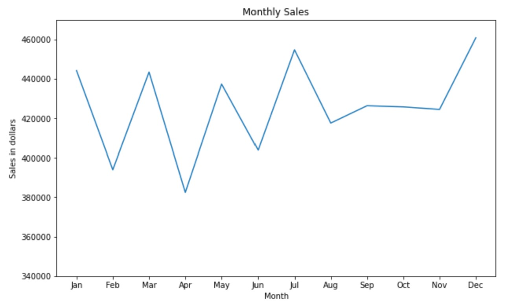
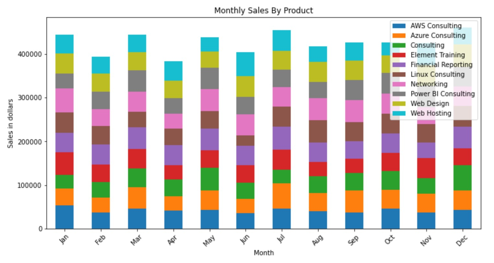
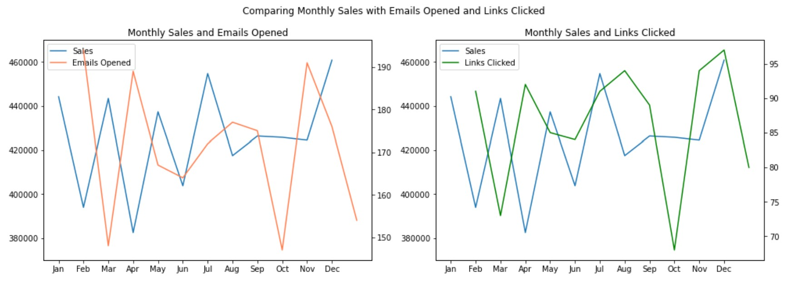
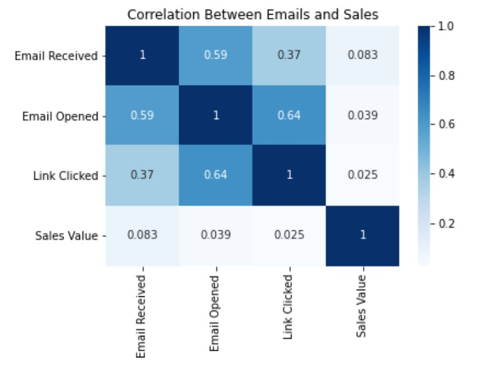

# ✉ Email Marketing Analysis
## Introduction
I analyzed a fictitious email marketing dataset from Enterprise DNA. The dataset was an excel file with 2 sheets. One had data of sales, and which product each customer bought. The other sheet had data of emails sent to each customer and whether the customer received it, opened it, and clicked on the link in the email. The goal of this analysis was to discover the relationship between emails and sales. **I used Python with the libraries NumPy, Pandas, Matplotlib, and Seaborn for this analysis.**

## Analysis
First, I checked the dataset for missing data and outliers. There were no missing values nor outliers, so I was able to start my analysis. I loaded the dataset into Jupyter Notebook and created 2 dataframes: one for sales and the other for emails. 

**Overview**
- I calculated the sum of the Sales Value column in the sales dataframe to get the total sales of $5,114,683.
- I counted the number of unique customers, which were 263 customers.
- I counted the rows in the sales dataframe, which were 10,000 sales order.
- I counted the number of unique products, which were 10 products.

  

 
The number of emails opened is lower than the number of emails received, and the number of links clicked is even lower. There is an email open rate of 24.5% and CTR of 12.4%.
 
 

  
  

 
Sales are highest in July and December and lowest in April. Each product has roughly similar sales each month.
 
 

  

 
Based on the line chart showing monthly sales and emails opened, the number of emails opened in November is very high compared to other months, but the sales is relatively low compared to all months. Similarly, for the chart showing monthly sales and links clicked on emails, the number of links clicked is very high in April, but the sales is the lowest among all months. Therefore, there seems to be no relationship between sales, emails opened, and links clicked. More emails opened and links clicked do not cause higher sales.
 
 

  

 
The heatmap shows a very low correlation coefficient between emails received, emails opened, links clicked, and sales value. There is no relationship between these 4 variables. In conclusion, more emails opened or links clicked in the emails do not imply higher sales. 
